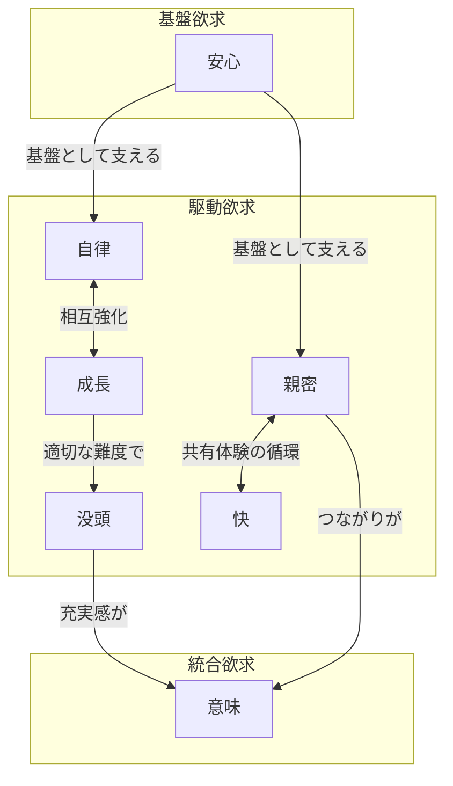

---
tags:
  - type/principle
  - topic/thinking
---

# 人生の目的を幸せの時間積分として捉える

自分の人生の目的関数を、ある瞬間における主観的な幸せ $h(t)$ の時間積分の最大化として定義する。

$$\max \int_0^T h(t) \, dt$$

これは厳密な計算のためのモデルではなく、人生で何を目指しているのかを端的に表現し、判断の枠組みを持つためのモデルである。

## モデルの設計判断

### h(t) は主観的でよい

$h(t)$ を変化させる要因は膨大で複雑であり（快楽順応、文脈依存性など）、厳密に定義・計測することは不可能である。しかし、その瞬間に自分が感じている幸せの主観的な量として扱えば十分機能する。$h(t)$ の内部メカニズムは所与として扱い、出力値として受け取る。

### 経験する自己を基準にする

Kahnemanの区別でいえば、このモデルは経験する自己（experiencing self）の側に立っている。「振り返ったときにどう感じるか」ではなく、「実際に生きた各瞬間の幸せの総量」が人生の価値を決める。

ただし、このモデルを意識して生きること自体がメタ認知として機能し、瞬間の幸せへの注意が高まるため、結果的に経験と記憶の乖離は小さくなる。

### 不確実性はこのモデルの外で扱う

確率的分散やリスクは、将来の戦略を立てる文脈で別途考えるものであり、目的関数の定義には含めない。人生が終わったときに決定的に評価できる量として設計している。

### T（健康寿命）も変数である

$T$ の延長はそのまま積分値の増大につながる。暮らしを整えること（健康管理、生活環境の維持）は $h(t)$ の基盤を守るだけでなく、$T$ 自体を最大化する意味でも重要になる。

## h(t) を構成する欲求の構造

$h(t)$ の内部構造を直接分解することは困難だが、どのような心理的欲求の充足が $h(t)$ を押し上げるかという観点で分析することはできる。

### 基盤欲求

| 欲求 | 内容 |
|------|------|
| **安心** | 身体的・経済的な脅威がなく、不安が少ない状態 |

欠けると $h(t)$ を大きく毀損する。閾値を超えると寄与は急速に減衰する。

### 駆動欲求

| 欲求 | 内容 |
|------|------|
| **自律** | 自分で選び、決め、コントロールしている感覚 |
| **成長** | 何かを知る・できるようになる喜び |
| **没頭** | 活動に深く入り込み、時間を忘れている状態 |
| **親密** | かけがえのない人との深いつながり |
| **快** | 純粋な感覚的・情動的な喜び |

$h(t)$ を積極的に押し上げる。自律と成長は正のフィードバックループを形成し、親密と快は体験の蓄積を通じて複利的に効く。

### 統合欲求

| 欲求 | 内容 |
|------|------|
| **意味** | 自分の存在や行動がより大きな何かに貢献している感覚 |

現時点では強く意識していないが、他の欲求が充足されるにつれ浮上してくる可能性がある。

## 欲求間の構造

- **安心**が基盤にあり、その上で他の欲求が機能する
- **自律と成長**は相互に強化する（能力が自由を広げ、自由が成長を可能にする）
- **成長が没頭を生む**（適切な難度の活動にフロー状態が生じる）
- **親密と快**は共有体験を通じて循環する（刹那的な体験 → 記憶 → 関係の質 → 次の体験の豊かさ）
- **意味**は他の欲求の充実の上に統合的に立ち上がる

## 関連ノート

- [[タスクを欲求と事象ドメインの2層で分類する]]
- [[常により上位の目的を意識する]]
- [[タスクの膨張感を上位目的への立ち返りで解消したケース]]
